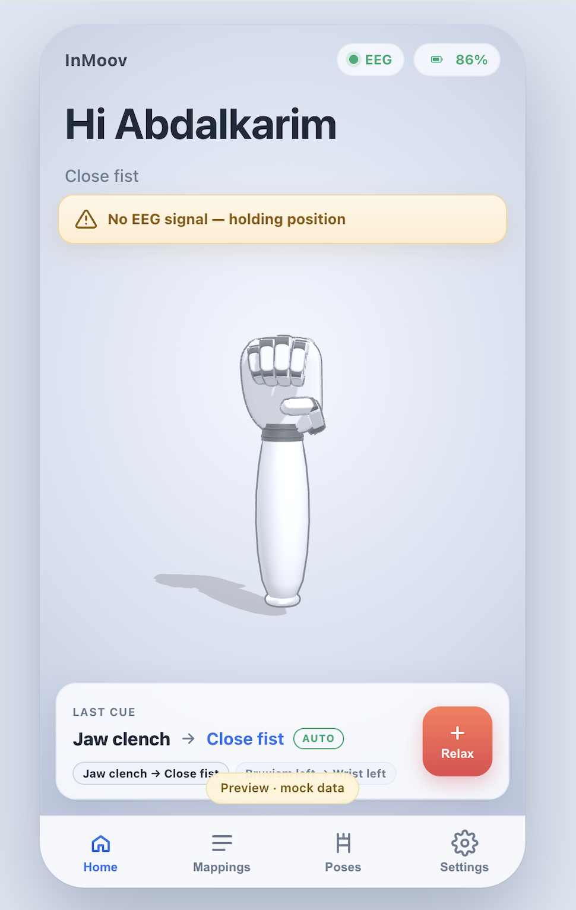

# NeuroGrasp

**An EEG-controlled 3D-printed prosthetic hand.** A person blinks or clenches
their jaw; two seconds later a printed InMoov hand opens, closes, or rotates its
wrist. No muscle sensors on the residual limb, no cloud, no internet — a clinical
EEG headset, a Raspberry Pi holding the classifier, and an ESP32 driving six
servos from its own WiFi access point.

Graduation project, ENCS5300 — Department of Electrical & Computer Engineering,
**Birzeit University**.

```
  EEG headset          Raspberry Pi 5              ESP32-WROOM            InMoov hand
 19 ch @ 200 Hz  ──►  gate → classify → FSM  ──►  dispatch → PWM  ──►   6× MG996R
                            (.edf over TCP)          (UART 115200)      24 printed parts
                                                          │
                                                          └── WiFi AP ──► web dashboard
```

| | |
|---|---|
| **Classes** | `single_blink`, `double_blink`, `clinch`, `bruxism_left`, `bruxism_right` |
| **Accuracy** | **91.8%**, macro-F1 **0.918** — leave-one-session-out, 1,246 gated windows |
| **Latency** | ~0.75 s classify, ~5.6 s press → hand moves (5 s clip is the floor, see below) |
| **Model** | Hierarchical hybrid: features → DTW-KNN (blinks) + Riemannian covariance (jaw) |
| **Hardware** | Raspberry Pi 5 · ESP32-WROOM 4 MB · 6× MG996R · 24 printed parts |

<p align="center">
  
</p>

---

## The idea, and why it isn't motor imagery

Decoding *imagined movement* from a low-cost montage is unreliable — that is the
honest state of the field, and it is why so many BCI demos never leave the lab.
This system decodes something else: **deliberate facial gestures** that produce
large, repeatable artifacts in the EEG. A blink is a huge frontal deflection. A
jaw clench is temporal EMG. Both are trivially easy to produce on command, and
they map cleanly onto discrete prosthetic actions.

That reframing is the whole design. It trades "reading intent" for "reading a
reliable switch a person can throw with their face" — which is what a prosthesis
user actually needs.

| Gesture | Class | Hand action |
|---|---|---|
| Blink once | `single_blink` | open hand |
| Blink twice | `double_blink` | pinch / confirm |
| Clench both sides | `clinch` | close fist |
| Grind jaw left | `bruxism_left` | rotate wrist left |
| Grind jaw right | `bruxism_right` | rotate wrist right |
| *(no gesture)* | `rest` | hold position |

Mappings are **not** hardcoded — they live in
[`hand-firmware/data/mappings.json`](hand-firmware/data/mappings.json) and are
editable from the phone while the hand is running.

## Repository layout

Seven pieces, each independently runnable:

| Directory | What it is |
|---|---|
| [`eeg-classifier/`](eeg-classifier/) | The BCI. Loading, preprocessing, 93 features, training, real-time inference. Includes the raw recordings and the trained models. |
| [`stimulus-app/`](stimulus-app/) | How the data was collected — a cue-and-marker app (desktop + web) that tells the subject what to do and timestamps it. |
| [`headset-link/`](headset-link/) | The laptop↔Pi transport: a browser dashboard that ships 5 s EDF snippets over TCP, plus the EDF conditioning tool. |
| [`raspberry-pi/`](raspberry-pi/) | The deployment. One `install.sh` that builds the venv, fixes the UART, and installs a boot service. |
| [`hand-firmware/`](hand-firmware/) | ESP32 firmware (PlatformIO) + the offline web dashboard it serves from LittleFS. |
| [`hardware/`](hardware/) | 24 print-ready STLs, the build checklist, and the parts/sourcing list. |
| [`docs/`](docs/) | The 14-chapter report (LaTeX + compiled PDF), architecture diagrams, research notes. |

## How a gesture becomes movement

**1 — Acquire.** 19-channel clinical EEG, 10–20 montage, 200 Hz, saved as `.edf`.
Three sessions from one subject; the system is single-subject by design — the
person who trains it is the person who uses it.

**2 — Condition.** Crop the first 40 s of settling → 50 Hz notch → 1–45 Hz
band-pass → common-average reference → 2 s windows at 50% overlap → drop any
window peaking above 500 µV → per-recording z-score.

That z-score is deliberate: it destroys absolute µV so features describe the
*shape* of a gesture rather than the gain of a recording. But blink amplitude
features genuinely need the µV scale, so preprocessing returns **both** copies
with an identical reject mask — `preprocess_recording_dual`.

**3 — Gate.** Roughly half of every recording is the subject sitting still
between gestures. Labelling those rest windows with the recording's class is
pure label noise. An activity gate — relevant-channel peak-to-peak, measured
relative to that recording's own 90th percentile — keeps only gesture-present
windows. This single change was worth **+3.1 points** of accuracy, concentrated
exactly on the classes that were drowning in rest.

**4 — Classify.** Blinks and jaw gestures fail in different ways, so they get
different mathematics:

```
                  ┌─ Stage 1: feature-based ─┐
   93 features ──►│   blink   vs   muscle    │
                  └──┬────────────────────┬──┘
                     │                    │
      Stage 2a: DTW-KNN on the      Stage 2b: Riemannian covariance
      raw blink waveform            → tangent space → classifier
      single vs double              clinch / brux-L / brux-R
      F1 0.83–0.84                  F1 0.95–0.99
```

Jaw gestures are a *spatial* pattern — which side of the head is active — and
covariance geometry captures that almost perfectly (`bruxism_left` reaches
precision 1.000). Blinks are a *temporal* pattern — one deflection or two —
which is a shape-matching problem, so DTW compares waveforms directly. Feature
vectors alone could not separate single from double blink; five attempts are
documented in the report, including the four that failed.

**5 — Commit.** A window is only allowed to fire a command after the model
agrees with itself **three times in a row** above 0.60 confidence. Anything
else — rest, low confidence, a different prediction — resets the streak. A
prosthetic hand that twitches on one noisy window is worse than one that waits.

**6 — Move.** The Pi sends a plain lowercase label over UART. The ESP32 looks it
up in the user's mapping table and drives the servos. If **no** label arrives for
3 seconds the hand *holds its current position* — it never goes limp and never
snaps to a default. That fail-safe is why the Pi sends `rest` every 1.2 s even
when nobody is doing anything.

## Being honest about the numbers

91.8% is a **leave-one-session-out** figure: train on two recording sessions,
test on the third, never on data from the session being scored. That is the
protocol the report defends, and it exists because an earlier, friendlier number
turned out to be wrong.

Sliding windows overlap by 50%, so a random train/test split puts near-duplicate
windows on both sides and scores the model on data it has effectively seen. That
inflated split reported ~0.80; grouping folds by recording collapsed it to
**0.45**. Chapter 9 of the report calls this "The Evaluation Methodology Crisis"
and it reshaped everything after it.

The dataset is also small — about three independent recordings per class, one
subject. Synthetic augmentation was tried and made things *worse* (−1.1%): the
bottleneck is the number of genuine sessions, not the number of windows. Clean
labels beat more data. Rejected experiments are documented alongside the
successful ones, because in this project the rejections did most of the design
work.

## Running it

Each directory has its own README with full detail. The fastest paths in:

**The hand's dashboard, no hardware at all.** It auto-detects `localhost` and
runs against an in-browser simulator with fake telemetry and a synthetic cue
stream:

```bash
cd hand-firmware/data && python3 -m http.server 8000 --bind 127.0.0.1
# → http://127.0.0.1:8000/
```

**Classify a real recording, no Pi and no hand:**

```bash
cd eeg-classifier
python3 -m venv .venv && .venv/bin/pip install -r requirements.txt
.venv/bin/python inference.py \
    --file "DATA/Session2/Blink/Double Blink/BLINK-DO.EDF" --no-serial
```

**Retrain from the raw EDFs:**

```bash
.venv/bin/python -m eeg_bci.train_dtw_hybrid   # the deployed model
.venv/bin/python -m eeg_bci.eval_loso          # the honest evaluation
```

**The full rig** — Pi + hand + laptop — is
[`raspberry-pi/README_PI.md`](raspberry-pi/README_PI.md), which is written to be
followed over `ssh` on a headless Pi and includes the traps that cost real days
(the Pi 5 puts `/dev/serial0` on the debug connector, not the GPIO header;
macOS AirPlay squats on port 5000).

## Why 5-second clips

`inference.preprocess_stream` band-passes with a 3.31 s FIR kernel and z-scores
over the whole signal, so a clip cannot be arbitrarily short — a 2 s window is
shorter than its own filter, and its z-score ends up set by the artifact instead
of by rest. That flips 25% of predicted labels.

| clip | label agreement | gate agreement | press → command |
|---|---|---|---|
| 3 s | 100% | 100% | too short for the FSM's 2.4 s |
| **5 s** | **100%** | **91%** | **~5.6 s** |
| 10 s | 100% | 94% | ~12 s |
| 30 s | 100% | 98% | ~36 s |

The predicted label never changes with clip length; only borderline confidence
decisions do. 5 s is the shortest clip that is longer than its own filter.

## Building the hand

24 printed parts in 4 assembly groups — forearm shell, rotational wrist, servo
bed, and the i2 hand — driven through tendon cables from a servo bed inside the
forearm.
[`hardware/3d-print/InMoov_RightHand_Forearm_PRINT_READY/BUILD_CHECKLIST.md`](hardware/3d-print/InMoov_RightHand_Forearm_PRINT_READY/BUILD_CHECKLIST.md)
has per-part orientation, supports, and infill; the sourcing list is in
[`hardware/bom/`](hardware/bom/).

The hand geometry is **Gaël Langevin's InMoov** (CC BY-NC 3.0) — this project
printed, assembled, and drove it, and did not design it. See [LICENSE](LICENSE).

## Documentation

| | |
|---|---|
| [Final report (PDF)](docs/ENCS5300-Final-Report.pdf) | 14 chapters — physiology, signal processing, the evaluation crisis, results |
| [`docs/report/`](docs/report/) | The LaTeX source. `pdflatex main.tex` |
| [`eeg-classifier/PROJECT_SUMMARY.md`](eeg-classifier/PROJECT_SUMMARY.md) | Engineering log: every experiment, including the rejected ones |
| [`docs/diagrams/`](docs/diagrams/) | System architecture, wiring, power distribution |
| [`docs/inmoov-build-guide.md`](docs/inmoov-build-guide.md) | Mechanical build notes |

## Author

**Karim Dwikat** — Birzeit University, 2026.

Licensed MIT for the code; the InMoov 3D geometry and the written report carry
their own terms, spelled out in [LICENSE](LICENSE).
